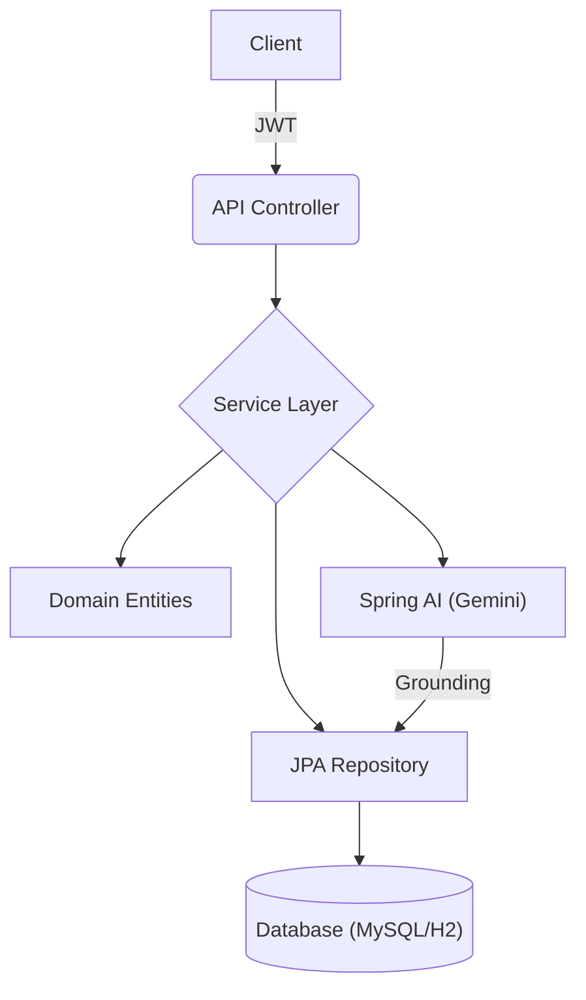

# AI-Augmented Order Management System

<div align="center">
  
  <p><i>A production-grade, AI-powered backend service for sophisticated order lifecycle management.</i></p>

  [](https://adoptium.net/)
  [](https://spring.io/projects/spring-boot)
  [](https://spring.io/projects/spring-ai)
  [](https://deepmind.google/technologies/gemini/)
  [](https://www.mysql.com/)
  [](https://jwt.io/)
  [](https://hibernate.org/)
  [](https://mapstruct.org/)
  [](https://projectlombok.org/)
  [](https://swagger.io/)
  [](https://maven.apache.org/)
  [](LICENSE)
</div>

---

## Overview

The AI-Augmented Order Management System is an enterprise-level backend platform designed to modernize order processing. By integrating Spring AI, it enables customers to interact with their order history using natural language, while maintaining strict data privacy through Prompt Grounding.

Built with Java 17 and Spring Boot, the system follows a clean layered architecture and implements robust security measures including stateless JWT authentication and Role-Based Access Control (RBAC).

---

## Key Features

### AI-Powered Support Assistant
*   **Natural Language Queries**: Users can ask questions like "Where is my latest iPhone order?" or "How much did I spend in April?".
*   **Prompt Grounding**: The system dynamically fetches and injects authorized order data into the AI context, ensuring the assistant only discusses data the user is permitted to see.
*   **Gemini Integration**: Powered by Spring AI's ChatClient, utilizing the `gemini-flash-latest` model for high-performance reasoning.

### Order Lifecycle Management
*   **End-to-End Tracking**: Full lifecycle support from `CREATED` → `PROCESSING` → `COMPLETED`/`CANCELLED`.
*   **Business Logic**: Automated tax calculations and total amount validation within the domain model.
*   **Optimized Persistence**: High-performance database interactions using JPA EntityGraphs to eliminate N+1 query problems.

### Enterprise Security
*   **Stateless Auth**: Robust JWT-based authentication with Refresh Token support.
*   **RBAC**: Granular permissions for `ADMIN` (full control) and `USER` (personal data access) roles.
*   **Secure API**: Comprehensive protection of all sensitive endpoints with custom security filters and CORS configuration.

---

## Architecture

The system is built on a Clean Layered Architecture, emphasizing modularity and separation of concerns.



### Project Structure
```text
io.github.vikij.ordermanagement
├── auth         # Security infrastructure (JWT, RBAC)
├── order        # Core domain, business logic, and mapping
├── ai           # AI orchestration and prompt grounding
├── user         # Identity management
├── common       # Shared exceptions and error models
└── config       # Infrastructure configuration (Dotenv, Security)
```

---

## API Reference

All API endpoints are prefixed with `/api/v1`.

### Authentication
| Method | Endpoint | Description |
| :--- | :--- | :--- |
| `POST` | `/api/v1/auth/signup` | Register a new user. |
| `POST` | `/api/v1/auth/login` | Obtain Access and Refresh Tokens. |
| `POST` | `/api/v1/auth/refresh` | Refresh an expired access token. |

### AI Support
| Method | Endpoint | Access | Description |
| :--- | :--- | :--- | :--- |
| `POST` | `/api/v1/ai/chat` | Authenticated | Query the AI assistant about your orders. |

### Orders
| Method | Endpoint | Access | Description |
| :--- | :--- | :--- | :--- |
| `POST` | `/api/v1/orders` | USER | Create a new order. |
| `GET` | `/api/v1/orders` | USER/ADMIN | Paginated list of orders. |
| `GET` | `/api/v1/orders/{orderNumber}/status` | Public | Get public status of an order. |
| `PATCH`| `/api/v1/orders/{orderNumber}/status` | ADMIN | Transition order status. |

---

## Prompt Grounding Implementation

The system implements a secure grounding pattern to prevent data leaks. Before sending a query to the LLM, the `AiService` performs the following steps:

1.  **Identify**: Extract the authenticated user identity from the security context.
2.  **Fetch**: Retrieve only the orders belonging to that specific user via `orderRepository.findByCreatedBy(user)`.
3.  **Context Injection**: Format the orders into a secure system prompt.
4.  **Execute**: Send the grounded prompt + user query to the AI model.

```java
// Logic used in AiService.java
String ordersData = userOrders.stream()
    .map(order -> String.format("- Order #%s: %s", order.getOrderNumber(), order.getStatus()))
    .collect(Collectors.joining("\n"));

return chatClient.prompt()
    .system(s -> s.text(SYSTEM_PROMPT_TEMPLATE)
        .param("name", user.getFirstName())
        .param("orders_data", ordersData))
    .user(userQuery)
    .call()
    .content();
```

---

## Technology Stack

*   **Core**: Java 17, Spring Boot 3.4.1
*   **AI**: Spring AI, Google Gemini (`gemini-flash-latest`)
*   **Data**: Hibernate, Spring Data JPA, MySQL (Production), H2 (Development)
*   **Mapping**: MapStruct (DTO <-> Entity)
*   **Security**: Spring Security, JJWT, Dotenv-java
*   **Docs**: Springdoc OpenAPI (Swagger UI)

---

## Setup & Installation

### 1. Clone the Repository
```bash
git clone https://github.com/i-viki/order-management-service.git
cd order-management-service
```

### 2. Configure Environment
The system uses `dotenv-java` to automatically load variables. Create a `.env` file in the project root:

```properties
# Server Configuration
SPRING_PROFILES_ACTIVE=dev

# AI Configuration (Google AI Studio)
GEMINI_API_KEY=your_gemini_api_key_here

# Security
JWT_SECRET=your_super_secret_jwt_key_at_least_32_characters_long
JWT_EXPIRATION_MS=3600000

# Database - H2 (Default for dev)
# To use MySQL, uncomment and update:
# DB_URL=jdbc:mysql://localhost:3306/order_management
# DB_USERNAME=root
# DB_PASSWORD=your_password
# DB_DRIVER=com.mysql.cj.jdbc.Driver
# HIBERNATE_DIALECT=org.hibernate.dialect.MySQLDialect
```

### 3. Run the Application
```bash
./mvnw spring-boot:run
```

---

## Author

**Jayavignesh**
*Backend Engineer specializing in High-Performance Java Systems.*

- [Portfolio](https://jayavignesh.dev)
- [GitHub](https://github.com/i-viki)
- [LinkedIn](https://www.linkedin.com/in/viki-j)

---
<div align="center">
  <sub>Built with Precision</sub>
</div>
